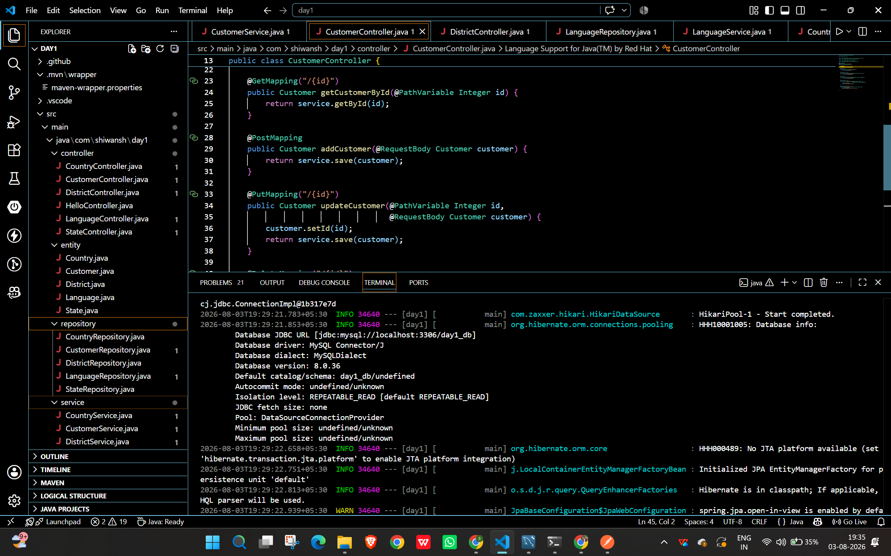
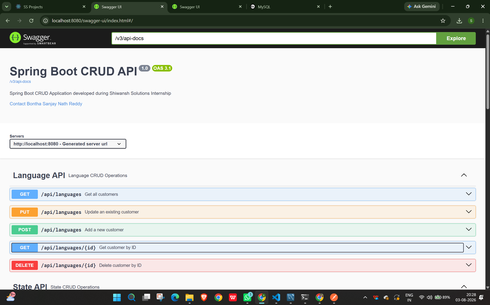
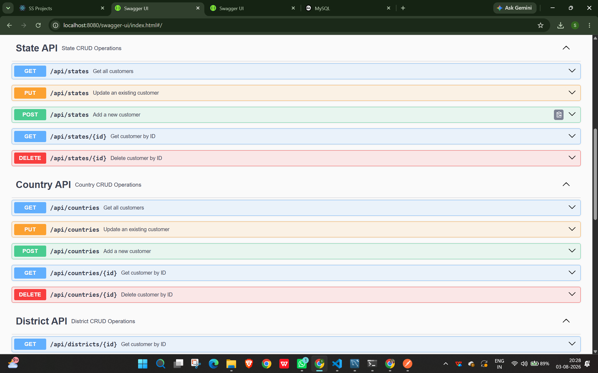
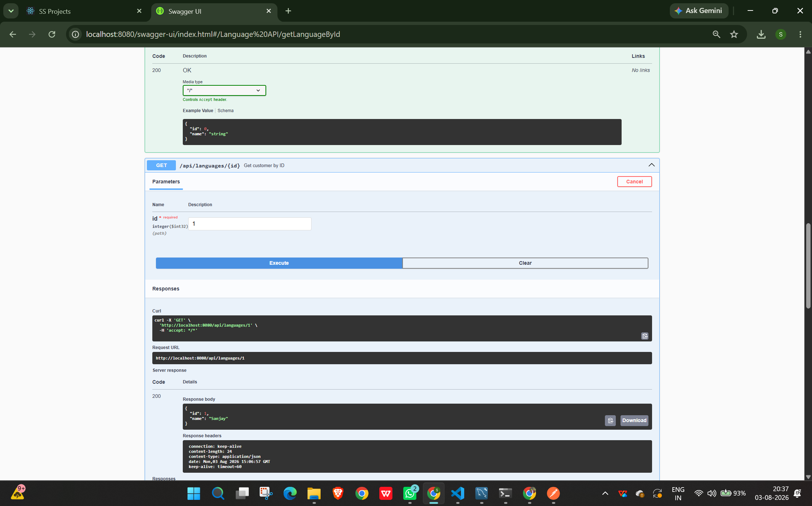
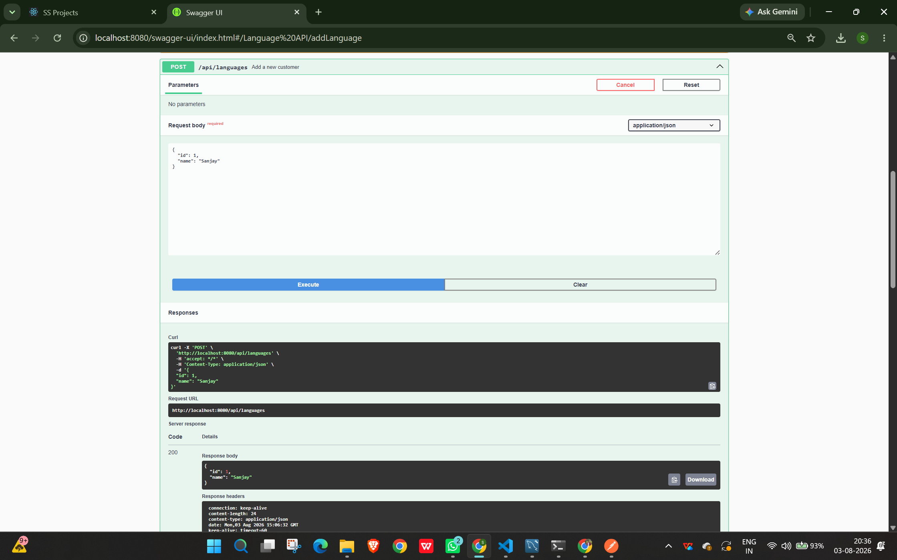
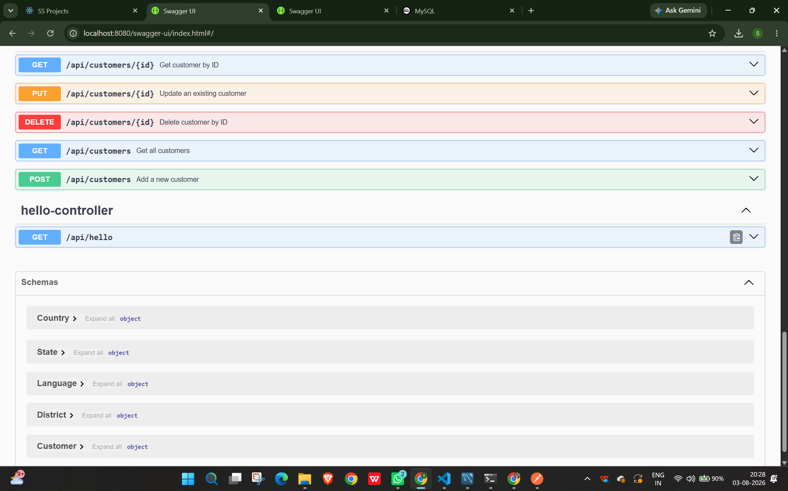

# Spring Boot CRUD API

A Spring Boot REST API project developed using Spring Boot, Spring Data JPA, MySQL, Swagger, and Postman.

## Technologies Used

- Java 17
- Spring Boot
- Spring Data JPA
- MySQL
- Maven
- Swagger (OpenAPI)
- Postman

## Project Structure


## Swagger UI


## State & Country


## Language CRUD - GET


## Language CRUD - POST


## Schemas


## Features

- Language CRUD
- Country CRUD
- State CRUD
- District CRUD
- Customer CRUD

## API Documentation

Swagger UI:

http://localhost:8080/swagger-ui/index.html

## Project Structure

```
Controller
Service
Repository
Entity
Config
```

## CRUD Operations

- Create
- Read
- Update
- Delete

## Author

**Bontha Sanjay Nath Reddy**
